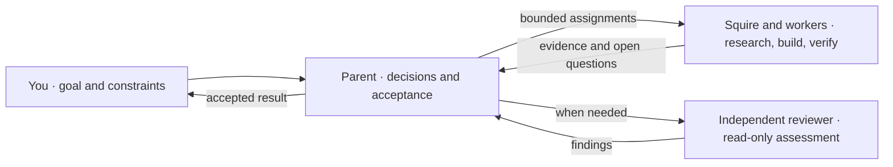

<div align="center">

# Codex Orchestrator

**Keep the decisions. Delegate autonomous work.**

A Codex plugin for coordinating native agents around a clear division of responsibilities.

Native agents · Model-agnostic orchestration · MIT licensed

[Quick start](#quick-start) · [How it works](#how-it-works) · [Model routing](#optional-model-routing) · [Migration](#migrating-from-astra-advisor)

</div>

Your selected model stays in charge of scope, decisions, and acceptance. A
**retained squire** — a delegate reused across related assignments — handles a
coherent autonomous task or independent workstream when delegation adds value. The
parent keeps short lookups and sequential critical-path work when briefing and
waiting would cost more. Independent reviewers assess changes when the work calls
for it.

The plugin packages this workflow as an [orchestration skill](plugins/codex-orchestrator/skills/orchestration/SKILL.md).
These are instructions for agents using the host's native tools; available
capabilities, your instructions, and repository permissions govern what can run.

## Quick start

**Requires:** Codex with plugin support and native agent delegation tools, plus
the `codex` CLI for the installation commands below.

1. Register this repository as a marketplace and install the plugin (no checkout
   needed):

   ```sh
   codex plugin marketplace add guilhem/codex-orchestrator
   codex plugin add codex-orchestrator@codex-orchestrator
   ```

2. Review the bundled hooks in Codex's hook settings. Codex skips plugin hooks
   until you trust their current definitions:

   | Hook shown in Codex | Event | When to trust it |
   | --- | --- | --- |
   | **Add Codex Orchestrator reminder** | `UserPromptSubmit` | For a delegation reminder on every prompt. Optional when you invoke the skill explicitly. |
   | **Install Codex Orchestrator routing profiles** | `SessionStart` | Only for [optional model routing](#optional-model-routing). |

3. Confirm that the plugin is installed and enabled:

   ```sh
   codex plugin list --marketplace codex-orchestrator
   ```

   Expect `codex-orchestrator@codex-orchestrator` with status
   `installed, enabled`. Then start a fresh task or CLI session, select your
   preferred parent model, and give it a concrete goal:

   ```text
   Use $codex-orchestrator:orchestration to fix the empty-search bug.
   Reproduce it, make the smallest fix, run the affected tests, and review the diff.
   ```

Follow-ups can reuse the same squire while its context remains useful. The parent
keeps the user conversation and decides what to do with the returned evidence.

If the newly installed plugin does not appear in Codex, restart the app and
check again. If a hook does not run, review its trust state in Codex's hook
settings.

## How it works



| Responsibility | How the skill assigns it |
| --- | --- |
| **Frame and decide** | The parent sets the objective, scope, ownership, and expected result; interprets evidence; and accepts the work. It keeps work direct when delegation would cost more. |
| **Research and execute** | When delegation adds value, the squire investigates, implements, verifies, and follows up within its assignment. It can coordinate workers when authorized. |
| **Review independently** | The parent requests a read-only acceptance review for changes to behavior, supported contracts, or authority boundaries, or when acceptance needs independent evidence. |
| **Report honestly** | Delegates return sources, completed actions and checks, uncertainty, and unresolved decisions. The parent reports observed results and material limitations. |

Assignments carry explicit scope and permissions. A research request does not
authorize edits. Give a squire the complete authorized outcome and stopping
condition, and let it finish dependent phases without routine parent handoffs. Reuse
it for follow-ups with changed context; split the initial assignment only for a
verified host routing constraint. Message delivery and interruption are host-specific:
use exposed controls and check active work before reassignment. After a bounded
correction, use affected checks and targeted review confirmation; wording-only
changes need parent assessment.

A simple choice can still be critical when other work depends on it and changing
course later would be costly. Before committing to such an open decision, the
parent seeks a bounded advisor opinion and reuses an existing challenge while its
evidence remains applicable. Critical advice requests the most capable suitable
model permitted by the user's settings and the host; the parent keeps the decision,
and the final acceptance review still checks the resulting work.

## What's included

| Component | Purpose |
| --- | --- |
| [Orchestration skill](plugins/codex-orchestrator/skills/orchestration/SKILL.md) | Instructions for delegation, squire reuse, review, and acceptance. |
| [Hooks](plugins/codex-orchestrator/hooks/hooks.json) | Once trusted, add a brief delegation reminder to each prompt and copy missing bundled profiles into the separate router's configuration directory. |

The orchestration skill needs no additional SDK or API key. Automatic model
selection is an optional integration described below.

## Optional model routing

Install and configure [codex-subagent-router](https://github.com/guilhem/codex-subagent-router)
separately to use Jev for model and effort selection on eligible native agent
spawns. That plugin owns the routing hook, SDK, and `TYPESAFE_API_KEY` setup.

Codex Orchestrator supplies three editable profiles:

| Profile | Assigned work | Model | Effort |
| --- | --- | --- | --- |
| [Routine](plugins/codex-orchestrator/routing/codex-orchestrator-routine.json) | Evidence collection, status checks, and bounded execution of existing commands. | `gpt-6-luna` | `max` |
| [Implementation](plugins/codex-orchestrator/routing/codex-orchestrator-implementation.json) | Ordinary code changes, tests, technical analysis, and review under a clear contract. | `gpt-6-sol` | `high` |
| [Complex](plugins/codex-orchestrator/routing/codex-orchestrator-complex.json) | Difficult diagnosis, architectural tradeoffs, and work with material security or data integrity risk. | `anthropic/claude-opus-5-5` | `high` |

To install them, trust **Install Codex Orchestrator routing profiles**
(`SessionStart`) in Codex's hook settings, then start a new session. The hook
copies missing `codex-orchestrator-*.json` files to
`$CODEX_HOME/subagent-router/`, falling back to `~/.codex/subagent-router/`
when `CODEX_HOME` is unset. It provides shell and
PowerShell commands for macOS/Linux and Windows respectively.

Edit the installed profiles to customize routing. Existing files are preserved.
To restore a bundled profile, delete its installed copy and start a new session;
disable the hook before removing the profiles permanently.

The skill leaves model and effort unset unless intentionally pinned. User and
repository requirements still apply. A routing choice records selection;
confirming which model actually ran requires runtime evidence.

## Migrating from Astra Advisor

The plugin and marketplace are now named `codex-orchestrator`. Existing
installations are not renamed automatically. Remove the old registration, then
follow [Quick start](#quick-start):

```sh
codex plugin remove astra-advisor@astra-advisor
codex plugin marketplace remove astra-advisor
```

- Update `$astra-advisor:orchestration` references in your instructions to `$codex-orchestrator:orchestration`.
- Move customizations from installed `astra-*.json` profiles to the new profiles, then remove obsolete copies to avoid duplicate routing choices.
- Update external settings that reference old profile IDs; those IDs are the filenames without `.json`.

The project is maintained at [`guilhem/codex-orchestrator`](https://github.com/guilhem/codex-orchestrator).

## Development and reference

From a local checkout of this repository, run the existing package validator
and tests:

```sh
sh plugins/codex-orchestrator/scripts/verify.sh
```

The verifier checks packaging, references, README links, and the bundled tests.
CI also runs the hook tests on Windows. These checks cover the packaged command,
not live host injection or agent behavior; host discovery, trust, and model routing
need host validation.

| Read more | Covers |
| --- | --- |
| [Native delegation](plugins/codex-orchestrator/skills/orchestration/references/operations.md) | Assignment boundaries, optional advice, and separately requested app tasks. |
| [Retained squire](plugins/codex-orchestrator/skills/orchestration/references/squire.md) | Reuse, reporting, and handoffs. |
| [Independent review](plugins/codex-orchestrator/skills/orchestration/references/review.md) | Acceptance criteria and correction follow-ups. |

---

Maintained by [Guilhem Lettron](https://github.com/guilhem). Derived from
[Astra Advisor](https://github.com/DannyMac180/astra-advisor) by Daniel McAteer.
[MIT licensed](LICENSE), with the original copyright attribution preserved.
